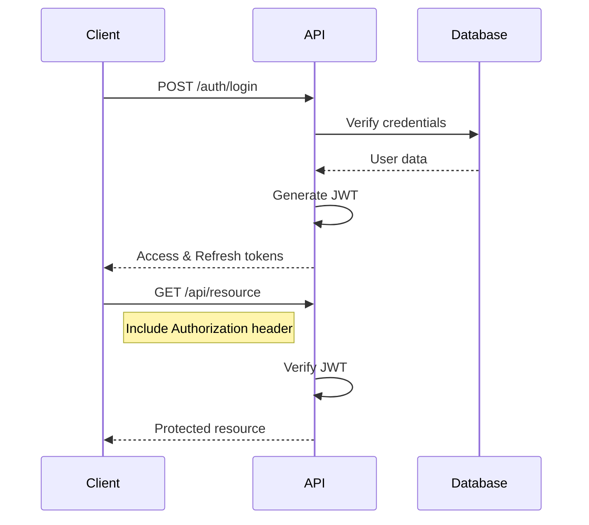
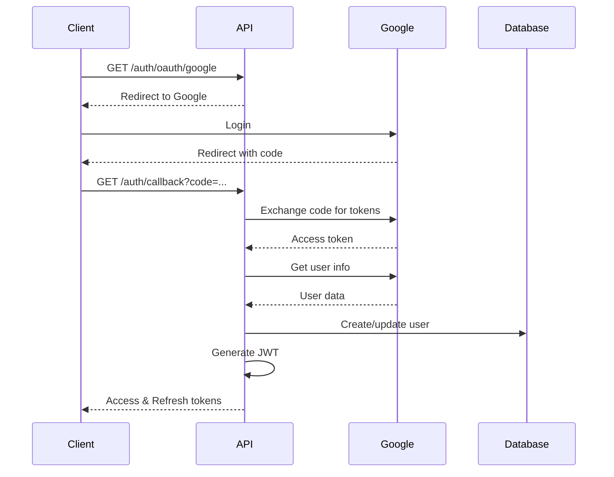

# Authentication API

CodexOS uses JWT-based authentication with support for OAuth2/SSO providers.

## Endpoints

### Login

```http
POST /api/v1/auth/login
Content-Type: application/json

{
  "username": "user@example.com",
  "password": "your-password"
}
```

**Response:**
```json
{
  "access_token": "eyJ0eXAiOiJKV1QiLCJhbGciOiJIUzI1NiJ9...",
  "token_type": "bearer",
  "expires_in": 3600,
  "refresh_token": "eyJ0eXAiOiJKV1QiLCJhbGciOiJIUzI1NiJ9..."
}
```

### Register

```http
POST /api/v1/users/
Content-Type: application/json

{
  "email": "user@example.com",
  "username": "username",
  "password": "secure-password",
  "full_name": "John Doe"
}
```

**Response:**
```json
{
  "id": "uuid",
  "email": "user@example.com",
  "username": "username",
  "full_name": "John Doe",
  "is_active": true,
  "created_at": "2024-01-01T00:00:00Z"
}
```

### Refresh Token

```http
POST /api/v1/auth/refresh
Content-Type: application/json

{
  "refresh_token": "eyJ0eXAiOiJKV1QiLCJhbGciOiJIUzI1NiJ9..."
}
```

### OAuth2 Login

```http
GET /api/v1/auth/oauth/{provider}
```

Supported providers:
- `google`
- `github`
- `auth0`
- `okta`
- `azure`

### Current User

```http
GET /api/v1/auth/me
Authorization: Bearer {access_token}
```

**Response:**
```json
{
  "id": "uuid",
  "email": "user@example.com",
  "username": "username",
  "full_name": "John Doe",
  "tenant": {
    "id": "uuid",
    "name": "Company Name",
    "plan": "professional"
  },
  "roles": [
    {
      "id": "uuid",
      "name": "developer",
      "permissions": ["agent:create", "agent:read", "agent:update"]
    }
  ]
}
```

## Authentication Flow

### 1. Standard Login


### 2. OAuth2 Flow


## Authorization

### Headers

All authenticated requests must include:
```http
Authorization: Bearer {access_token}
```

### Token Structure

JWT tokens contain:
```json
{
  "sub": "user-uuid",
  "email": "user@example.com",
  "tenant_id": "tenant-uuid",
  "roles": ["developer"],
  "exp": 1234567890,
  "iat": 1234567890
}
```

### Permissions

Permission format: `resource:action`

Resources:
- `agent` - Agent flows
- `rag` - RAG documents
- `vault` - Secure vault
- `marketplace` - Marketplace items
- `tenant` - Tenant settings
- `user` - User management

Actions:
- `create`
- `read`
- `update`
- `delete`
- `execute`
- `publish`

### Role Hierarchy

1. **Super Admin** - Full system access
2. **Tenant Admin** - Full tenant access
3. **Team Lead** - Team management
4. **Developer** - Create and manage resources
5. **Analyst** - Read and execute
6. **Viewer** - Read only

## Security

### Password Requirements
- Minimum 8 characters
- At least one uppercase letter
- At least one lowercase letter
- At least one number
- At least one special character

### Token Expiration
- Access token: 30 minutes
- Refresh token: 7 days
- Session timeout: 24 hours

### Rate Limiting
- Login: 5 attempts per minute
- Register: 3 attempts per minute
- API calls: 100 per minute (authenticated)

## Multi-Factor Authentication

### Enable MFA

```http
POST /api/v1/auth/mfa/enable
Authorization: Bearer {access_token}
```

**Response:**
```json
{
  "secret": "JBSWY3DPEHPK3PXP",
  "qr_code": "data:image/png;base64,...",
  "backup_codes": [
    "12345678",
    "87654321",
    "..."
  ]
}
```

### Verify MFA

```http
POST /api/v1/auth/mfa/verify
Content-Type: application/json

{
  "code": "123456"
}
```

### Login with MFA

```http
POST /api/v1/auth/login
Content-Type: application/json

{
  "username": "user@example.com",
  "password": "your-password",
  "mfa_code": "123456"
}
```

## Error Responses

### 401 Unauthorized
```json
{
  "detail": "Invalid authentication credentials"
}
```

### 403 Forbidden
```json
{
  "detail": "Not enough permissions"
}
```

### 422 Validation Error
```json
{
  "detail": [
    {
      "loc": ["body", "password"],
      "msg": "Password must be at least 8 characters",
      "type": "value_error"
    }
  ]
}
```
