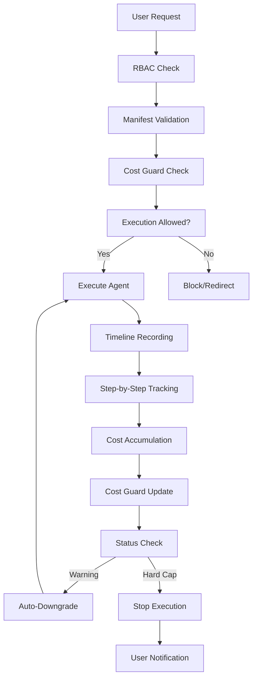

# CodexOS RBAC Enhancements Summary

> **📚 Docs ▸ RBAC & Security**  
> **Last Updated**: December 19, 2024  
> **Status**: Implementation Complete

## 🎯 Overview

This document summarizes the three major RBAC enhancements implemented to make CodexOS's role-based access control system "pop":

1. **Run Timeline + Replay** - Detailed execution tracking with fork & replay capabilities
2. **Signed Agent Manifests** - Cryptographically signed agent configurations with entitlements
3. **Cost Guard** - Per-tenant budget management with auto-downgrade

## 🔄 How They Work Together

### Execution Flow with Enhanced RBAC



## 🚀 Feature 1: Run Timeline + Replay

### What It Does
- Records every step of agent execution (tool calls, LLM calls, RAG queries)
- Tracks performance metrics (latency, tokens, cost)
- Enables replay from any step with new input data
- Provides detailed cost breakdown by step

### Key Benefits
- **Debugging**: Identify exactly where executions fail
- **Optimization**: Find performance bottlenecks
- **Cost Analysis**: Understand spending patterns
- **Reproducibility**: Replay successful executions

### Technical Implementation
```python
# Create execution step
step = ExecutionStep(
    step_number=1,
    step_type="llm_call",
    step_name="Generate Response",
    model_name="gpt-4",
    prompt_tokens=150,
    completion_tokens=75,
    cost_cents=2,
    can_replay_from=True
)

# Replay from step
replay_execution = timeline_service.replay_execution_from_step(
    execution_id=original_id,
    step_number=5,
    new_input_data={"query": "Updated question"}
)
```

## 🔐 Feature 2: Signed Agent Manifests

### What It Does
- Cryptographically signs agent configurations
- Defines allowed tools, models, and data access
- Enforces compliance requirements (SOC2, HIPAA, GDPR)
- Validates entitlements at runtime

### Key Benefits
- **Security**: Tamper-proof agent configurations
- **Compliance**: Built-in regulatory compliance
- **Governance**: Centralized policy management
- **Audit**: Complete change tracking

### Technical Implementation
```yaml
# agent.yaml manifest
version: "1.0.0"
capabilities: ["text_generation", "document_search"]
supported_models: ["gpt-4", "claude-3-opus"]
allowed_tools: ["web_search", "file_reader"]
max_cost_per_execution: 1000  # 10 USD
security_level: "enterprise"
compliance_requirements: ["SOC2", "HIPAA"]
```

```python
# Verify manifest
is_valid = manifest_service.verify_manifest(
    manifest_id=manifest_id,
    public_key=public_key,
    verifier=current_user
)

# Check entitlements
entitlements = manifest_service.check_manifest_entitlements(
    manifest_id=manifest_id,
    requested_tools=["web_search"],
    requested_models=["gpt-4"],
    estimated_cost_cents=500
)
```

## 💰 Feature 3: Cost Guard

### What It Does
- Sets per-tenant monthly spending limits
- Implements soft/hard caps with automatic enforcement
- Auto-downgrades models when approaching limits
- Provides cost analytics and recommendations

### Key Benefits
- **Budget Control**: Prevent runaway costs
- **Auto-Optimization**: Smart model switching
- **Transparency**: Clear spending visibility
- **Compliance**: Enforce budget policies

### Technical Implementation
```python
# Check if execution allowed
execution_check = cost_guard_service.can_execute_agent(
    tenant_id=tenant_id,
    estimated_cost_cents=500,
    requested_models=["gpt-4"]
)

if execution_check["can_execute"]:
    # Execute with recommended models
    models_to_use = execution_check["recommended_models"]
else:
    # Block execution or use fallback
    handle_budget_exceeded(execution_check)

# Update spending after execution
cost_guard_service.update_monthly_spending(
    tenant_id=tenant_id,
    additional_cost_cents=actual_cost,
    execution_id=execution_id,
    cost_breakdown=cost_details
)
```

## 🔗 Integration Points

### 1. Execution → Timeline → Cost Guard
```python
# During execution
for step in execution_steps:
    # Record step in timeline
    timeline_service.create_execution_step(step)
    
    # Update cost guard
    cost_guard_service.update_monthly_spending(
        tenant_id=tenant_id,
        additional_cost_cents=step.cost_cents
    )
    
    # Check if we need to auto-downgrade
    if cost_guard.status == "warning":
        recommended_model = cost_guard.get_recommended_model(step.model_name)
        if recommended_model != step.model_name:
            step.model_name = recommended_model
```

### 2. Manifest → Cost Guard → Execution
```python
# Before execution
manifest = manifest_service.get_manifest_by_flow(flow_id)
cost_check = cost_guard_service.can_execute_agent(
    tenant_id=tenant_id,
    estimated_cost_cents=manifest.max_cost_per_execution
)

if not cost_check["can_execute"]:
    raise BudgetExceededError("Execution blocked by cost guard")

# Validate manifest entitlements
entitlements = manifest_service.check_manifest_entitlements(
    manifest_id=manifest.id,
    requested_tools=requested_tools,
    requested_models=cost_check["recommended_models"]
)
```

### 3. Timeline → Manifest → Compliance
```python
# After execution
timeline = timeline_service.get_execution_timeline(execution_id)
compliance_report = manifest_service.validate_manifest_compliance(
    manifest_id=manifest.id
)

# Generate audit log
audit_service.log_execution(
    execution_id=execution_id,
    manifest_id=manifest.id,
    compliance_status=compliance_report["is_compliant"],
    cost_breakdown=timeline["cost_breakdown"]
)
```

## 🎨 User Experience Flow

### For Developers
1. **Create Agent** → Define capabilities and tools
2. **Sign Manifest** → Cryptographically sign configuration
3. **Deploy** → System validates manifest and entitlements
4. **Monitor** → View execution timeline and costs
5. **Optimize** → Use replay to improve performance

### For Administrators
1. **Set Budgets** → Configure tenant spending limits
2. **Monitor Costs** → Track spending across all agents
3. **Enforce Policies** → Use manifests for compliance
4. **Audit Access** → Review execution timelines
5. **Override Limits** → Temporary budget increases

### For Compliance Officers
1. **Define Standards** → Set compliance requirements
2. **Validate Manifests** → Check against policies
3. **Monitor Execution** → Ensure policy compliance
4. **Generate Reports** → SOC2, HIPAA, GDPR compliance
5. **Audit Changes** → Track all modifications

## 🔒 Security Features

### Cryptographic Security
- **RSA-2048+** signatures for manifests
- **SHA-256** hashing for integrity
- **Base64** encoding for signatures
- **Key rotation** support

### Access Control
- **Role-based** permission system
- **Tenant isolation** for all data
- **Audit logging** for all actions
- **Rate limiting** on sensitive operations

### Data Protection
- **Encryption at rest** for sensitive data
- **TLS 1.3** for data in transit
- **Data retention** policies
- **Privacy controls** for user data

## 📊 Compliance Features

### SOC2 Type II
- ✅ Access control enforcement
- ✅ Audit trail maintenance
- ✅ Data retention management
- ✅ Security incident tracking

### HIPAA
- ✅ PHI data protection
- ✅ Access logging
- ✅ Encryption standards
- ✅ Business associate controls

### GDPR
- ✅ Data minimization
- ✅ Right to be forgotten
- ✅ Data portability
- ✅ Privacy impact assessment

## 🚀 Performance Optimizations

### Database Indexing
- Execution steps by execution_id + step_number
- Cost guard by tenant_id + status
- Manifests by flow_id + version
- Timeline queries optimized for common patterns

### Caching Strategy
- Manifest validation results cached
- Cost guard status cached per tenant
- Timeline data cached for recent executions
- Compliance check results cached

### Batch Operations
- Bulk cost guard updates
- Batch manifest verification
- Timeline data cleanup in batches
- Cost analytics aggregation

## 🔮 Future Enhancements

### Planned Features
1. **AI-Powered Cost Optimization** - ML-based spending recommendations
2. **Advanced Compliance Frameworks** - ISO 27001, FedRAMP support
3. **Real-time Budget Alerts** - Push notifications and webhooks
4. **Multi-Cloud Cost Management** - AWS, Azure, GCP integration
5. **Advanced Analytics** - Predictive cost modeling

### Integration Opportunities
1. **SIEM Systems** - Security information and event management
2. **GRC Platforms** - Governance, risk, and compliance
3. **Financial Systems** - ERP and accounting integration
4. **DevOps Tools** - CI/CD pipeline integration
5. **Monitoring Platforms** - Prometheus, Grafana integration

## 📝 Conclusion

These three RBAC enhancements transform CodexOS from a basic access control system into a comprehensive, enterprise-grade security and compliance platform. By combining execution tracking, manifest signing, and cost management, organizations can:

- **Ensure Security** through cryptographic validation and audit trails
- **Maintain Compliance** with built-in regulatory frameworks
- **Control Costs** with intelligent budget management
- **Optimize Performance** through detailed execution analysis
- **Enable Governance** with centralized policy management

The system is designed to scale from small teams to enterprise organizations while maintaining security, performance, and usability standards.
