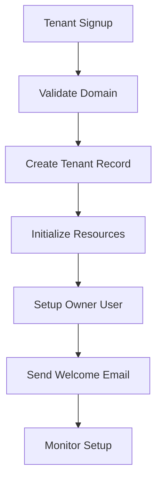

# CodexOS Multi-Tenancy

## Overview

CodexOS implements a comprehensive multi-tenant architecture that provides complete isolation between tenants while maintaining efficient resource utilization and scalability.

## 🏗️ Architecture Principles

### 1. **Tenant Isolation**
- **Complete Data Separation**: Each tenant's data is completely isolated
- **Resource Quotas**: Per-tenant resource limits and quotas
- **Network Isolation**: Tenant-specific network policies and egress controls

### 2. **Shared Infrastructure**
- **Common Services**: Shared backend services with tenant context
- **Efficient Resource Usage**: Optimized resource sharing where safe
- **Cost Optimization**: Reduced infrastructure costs through sharing

### 3. **Security by Design**
- **Zero Trust Model**: All access requires explicit tenant context
- **Audit Logging**: Complete audit trail for all tenant operations
- **Compliance Ready**: SOC2 and ISO 27001 compliant multi-tenancy

## 🔐 Tenant Model

### Tenant Structure

```typescript
interface Tenant {
  id: string;
  name: string;
  domain: string;
  status: 'active' | 'suspended' | 'deleted';
  plan: 'free' | 'pro' | 'enterprise';
  limits: {
    users: number;
    agents: number;
    storage: number;
    apiCalls: number;
  };
  settings: {
    features: string[];
    integrations: string[];
    customizations: Record<string, any>;
  };
  createdAt: Date;
  updatedAt: Date;
}
```

### User-Tenant Relationship

```typescript
interface UserTenant {
  userId: string;
  tenantId: string;
  role: 'owner' | 'admin' | 'member' | 'viewer';
  permissions: string[];
  joinedAt: Date;
  lastActive: Date;
}
```

## 🗄️ Data Isolation

### Database Level

#### Row-Level Security (RLS)
```sql
-- Enable RLS on all tables
ALTER TABLE users ENABLE ROW LEVEL SECURITY;
ALTER TABLE agents ENABLE ROW LEVEL SECURITY;
ALTER TABLE documents ENABLE ROW LEVEL SECURITY;

-- Create policies for tenant isolation
CREATE POLICY tenant_isolation_policy ON users
  FOR ALL USING (tenant_id = current_setting('app.current_tenant_id')::uuid);
```

#### Tenant Context
```python
# Set tenant context for all database operations
async def set_tenant_context(tenant_id: str):
    await db.execute(
        "SET app.current_tenant_id = :tenant_id",
        {"tenant_id": tenant_id}
    )
```

### Cache Level

#### Namespace Isolation
```python
# Redis key namespacing
def get_cache_key(tenant_id: str, key: str) -> str:
    return f"tenant:{tenant_id}:{key}"

# Example usage
cache_key = get_cache_key(tenant_id, "user:profile")
redis_client.set(cache_key, user_data)
```

### File Storage

#### S3 Bucket Organization
```
s3://codexos-storage/
├── tenant-001/
│   ├── documents/
│   ├── uploads/
│   └── exports/
├── tenant-002/
│   ├── documents/
│   ├── uploads/
│   └── exports/
└── shared/
    ├── templates/
    └── system/
```

## 🚀 Tenant Provisioning

### 1. **Tenant Creation**

```python
async def create_tenant(
    name: str,
    domain: str,
    plan: str,
    owner_email: str
) -> Tenant:
    # Create tenant record
    tenant = await tenant_service.create({
        "name": name,
        "domain": domain,
        "plan": plan,
        "status": "active"
    })
    
    # Create owner user
    owner = await user_service.create({
        "email": owner_email,
        "tenant_id": tenant.id,
        "role": "owner"
    })
    
    # Initialize tenant resources
    await initialize_tenant_resources(tenant.id)
    
    return tenant
```

### 2. **Resource Initialization**

```python
async def initialize_tenant_resources(tenant_id: str):
    # Create database schemas
    await db.execute(f"CREATE SCHEMA IF NOT EXISTS tenant_{tenant_id}")
    
    # Initialize vector database collections
    await chroma_client.create_collection(f"tenant_{tenant_id}_documents")
    
    # Set up default configurations
    await setup_default_configs(tenant_id)
    
    # Create monitoring dashboards
    await create_tenant_dashboard(tenant_id)
```

### 3. **Plan-Based Limits**

```python
TENANT_PLANS = {
    "free": {
        "users": 5,
        "agents": 10,
        "storage_gb": 1,
        "api_calls_per_month": 1000,
        "features": ["basic_rag", "simple_agents"]
    },
    "pro": {
        "users": 25,
        "agents": 100,
        "storage_gb": 10,
        "api_calls_per_month": 10000,
        "features": ["advanced_rag", "complex_agents", "marketplace"]
    },
    "enterprise": {
        "users": -1,  # Unlimited
        "agents": -1,  # Unlimited
        "storage_gb": 100,
        "api_calls_per_month": 100000,
        "features": ["all_features", "custom_integrations", "dedicated_support"]
    }
}
```

## 🔒 Security Implementation

### 1. **Authentication & Authorization**

```python
@router.get("/agents/{agent_id}")
async def get_agent(
    agent_id: str,
    current_user: User = Depends(get_current_user),
    current_tenant: str = Depends(get_current_tenant)
):
    # Verify user belongs to current tenant
    if not await user_service.belongs_to_tenant(
        current_user.id, current_tenant
    ):
        raise HTTPException(status_code=403, detail="Access denied")
    
    # Get agent with tenant isolation
    agent = await agent_service.get_by_id_and_tenant(
        agent_id, current_tenant
    )
    
    return agent
```

### 2. **API Rate Limiting**

```python
class TenantRateLimiter:
    def __init__(self, redis_client):
        self.redis = redis_client
    
    async def check_rate_limit(
        self, 
        tenant_id: str, 
        endpoint: str,
        limit: int,
        window: int
    ) -> bool:
        key = f"rate_limit:{tenant_id}:{endpoint}"
        current = await self.redis.incr(key)
        
        if current == 1:
            await self.redis.expire(key, window)
        
        return current <= limit
```

### 3. **Data Encryption**

```python
class TenantEncryption:
    def __init__(self, tenant_id: str):
        self.tenant_id = tenant_id
        self.key = self._get_tenant_key(tenant_id)
    
    def encrypt_field(self, data: str) -> str:
        # Use tenant-specific encryption key
        return encrypt_aes_256_gcm(data, self.key)
    
    def decrypt_field(self, encrypted_data: str) -> str:
        return decrypt_aes_256_gcm(encrypted_data, self.key)
```

## 📊 Monitoring & Observability

### 1. **Tenant Metrics**

```python
# Prometheus metrics with tenant labels
TENANT_API_REQUESTS = Counter(
    'tenant_api_requests_total',
    'Total API requests by tenant',
    ['tenant_id', 'endpoint', 'method', 'status']
)

TENANT_RESOURCE_USAGE = Gauge(
    'tenant_resource_usage',
    'Resource usage by tenant',
    ['tenant_id', 'resource_type']
)
```

### 2. **Grafana Dashboards**

- **Per-Tenant Dashboards**: Individual tenant performance metrics
- **Aggregate Views**: Cross-tenant analytics and trends
- **Resource Utilization**: Storage, API calls, and user activity
- **Cost Analysis**: Resource consumption and billing metrics

### 3. **Alerting**

```yaml
# Prometheus alerting rules
groups:
  - name: tenant_alerts
    rules:
      - alert: TenantResourceExhaustion
        expr: tenant_resource_usage > 0.9
        for: 5m
        labels:
          severity: warning
        annotations:
          summary: "Tenant {{ $labels.tenant_id }} approaching resource limits"
```

## 🔄 Tenant Lifecycle Management

### 1. **Provisioning Workflow**



### 2. **Suspension & Deletion**

```python
async def suspend_tenant(tenant_id: str, reason: str):
    # Update tenant status
    await tenant_service.update_status(tenant_id, "suspended")
    
    # Stop all running agents
    await agent_service.stop_all_for_tenant(tenant_id)
    
    # Log suspension
    await audit_service.log(
        "tenant_suspended",
        tenant_id=tenant_id,
        reason=reason
    )
    
    # Notify tenant owners
    await notification_service.notify_tenant_owners(
        tenant_id, "suspension_notice"
    )

async def delete_tenant(tenant_id: str):
    # Soft delete - mark as deleted
    await tenant_service.mark_deleted(tenant_id)
    
    # Schedule hard deletion (30 days)
    await schedule_hard_deletion(tenant_id, days=30)
    
    # Export tenant data
    await export_tenant_data(tenant_id)
```

### 3. **Data Retention**

```python
TENANT_RETENTION_POLICY = {
    "active": {
        "logs": "1 year",
        "audit_trails": "7 years",
        "user_data": "indefinite",
        "agent_executions": "90 days"
    },
    "suspended": {
        "logs": "30 days",
        "audit_trails": "1 year",
        "user_data": "1 year",
        "agent_executions": "30 days"
    },
    "deleted": {
        "logs": "7 days",
        "audit_trails": "90 days",
        "user_data": "30 days",
        "agent_executions": "7 days"
    }
}
```

## 🌐 Custom Domains

### 1. **Domain Verification**

```python
async def verify_domain_ownership(tenant_id: str, domain: str):
    # Generate verification token
    token = generate_verification_token()
    
    # Create verification record
    await domain_verification_service.create({
        "tenant_id": tenant_id,
        "domain": domain,
        "token": token,
        "status": "pending"
    })
    
    # Send verification email
    await email_service.send_domain_verification(
        tenant_id, domain, token
    )

async def verify_domain_token(token: str):
    verification = await domain_verification_service.get_by_token(token)
    
    if verification and verification.status == "pending":
        # Update tenant domain
        await tenant_service.update_domain(
            verification.tenant_id, 
            verification.domain
        )
        
        # Mark verification as complete
        await domain_verification_service.mark_verified(token)
        
        # Setup SSL certificate
        await ssl_service.setup_certificate(verification.domain)
```

### 2. **SSL Certificate Management**

```python
class SSLCertificateManager:
    async def setup_certificate(self, domain: str):
        # Request Let's Encrypt certificate
        cert = await letsencrypt_service.request_certificate(domain)
        
        # Store certificate securely
        await certificate_store.store(domain, cert)
        
        # Configure Nginx
        await nginx_service.configure_ssl(domain, cert)
        
        # Setup auto-renewal
        await schedule_certificate_renewal(domain)
```

## 💰 Billing & Usage Tracking

### 1. **Usage Metrics**

```python
class TenantUsageTracker:
    async def track_api_call(self, tenant_id: str, endpoint: str):
        # Increment API call counter
        await self.redis.incr(f"usage:{tenant_id}:api_calls")
        
        # Track endpoint usage
        await self.redis.incr(f"usage:{tenant_id}:endpoints:{endpoint}")
        
        # Update Prometheus metrics
        TENANT_API_REQUESTS.labels(
            tenant_id=tenant_id,
            endpoint=endpoint,
            method="GET",
            status="200"
        ).inc()
    
    async def track_storage_usage(self, tenant_id: str, bytes_used: int):
        # Update storage usage
        await self.redis.set(
            f"usage:{tenant_id}:storage_bytes",
            bytes_used
        )
        
        # Update Prometheus metrics
        TENANT_RESOURCE_USAGE.labels(
            tenant_id=tenant_id,
            resource_type="storage"
        ).set(bytes_used)
```

### 2. **Billing Integration**

```python
class TenantBillingService:
    async def generate_monthly_bill(self, tenant_id: str):
        tenant = await tenant_service.get_by_id(tenant_id)
        usage = await usage_tracker.get_monthly_usage(tenant_id)
        
        # Calculate costs based on plan and usage
        bill = self.calculate_bill(tenant.plan, usage)
        
        # Create Stripe invoice
        invoice = await stripe_service.create_invoice(
            tenant.stripe_customer_id,
            bill
        )
        
        # Send billing notification
        await notification_service.send_billing_notification(
            tenant_id, invoice
        )
        
        return invoice
```

## 🧪 Testing Multi-Tenancy

### 1. **Isolation Tests**

```python
async def test_tenant_isolation():
    # Create test tenants
    tenant1 = await create_test_tenant("test1")
    tenant2 = await create_test_tenant("test2")
    
    # Create users in different tenants
    user1 = await create_test_user(tenant1.id)
    user2 = await create_test_user(tenant2.id)
    
    # Verify data isolation
    agents1 = await agent_service.get_by_tenant(tenant1.id)
    agents2 = await agent_service.get_by_tenant(tenant2.id)
    
    assert len(agents1) == 0
    assert len(agents2) == 0
    
    # Create agent in tenant1
    agent1 = await agent_service.create(
        user_id=user1.id,
        tenant_id=tenant1.id,
        name="Test Agent"
    )
    
    # Verify tenant2 cannot access tenant1's agent
    with pytest.raises(HTTPException):
        await agent_service.get_by_id_and_tenant(
            agent1.id, tenant2.id
        )
```

### 2. **Performance Tests**

```python
async def test_tenant_scalability():
    # Create multiple tenants
    tenants = []
    for i in range(100):
        tenant = await create_test_tenant(f"perf_test_{i}")
        tenants.append(tenant)
    
    # Simulate concurrent usage
    tasks = []
    for tenant in tenants:
        task = simulate_tenant_workload(tenant.id)
        tasks.append(task)
    
    # Execute concurrently
    results = await asyncio.gather(*tasks)
    
    # Verify performance metrics
    for result in results:
        assert result.response_time < 1000  # < 1 second
        assert result.success_rate > 0.99   # > 99% success
```

## 🚀 Future Enhancements

### 1. **Advanced Features**

- **Tenant Cloning**: Copy tenant configurations and data
- **Cross-Tenant Collaboration**: Secure sharing between trusted tenants
- **Tenant Templates**: Pre-configured tenant setups for different use cases
- **Advanced Analytics**: Cross-tenant insights and benchmarking

### 2. **Enterprise Features**

- **Tenant Hierarchies**: Parent-child tenant relationships
- **Advanced RBAC**: Fine-grained permission management
- **Compliance Reporting**: Automated compliance and audit reports
- **Data Residency**: Geographic data location controls

## 📚 Additional Resources

- **[Architecture Guide](architecture.md)** - System design details
- **[Security Guide](threat-model.md)** - Security considerations
- **[API Reference](api/api-reference.md)** - Multi-tenant API endpoints
- **[Deployment Guide](production.md)** - Production deployment procedures
